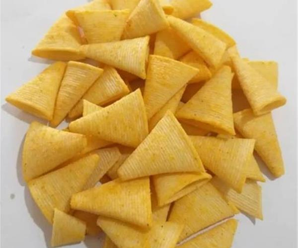
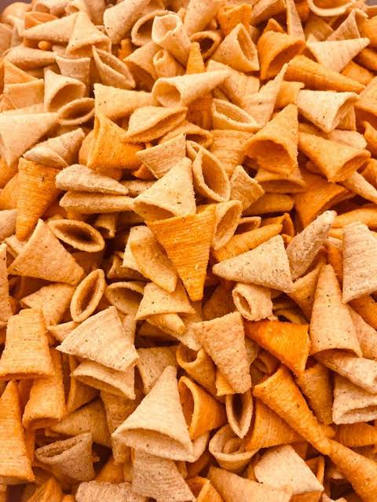
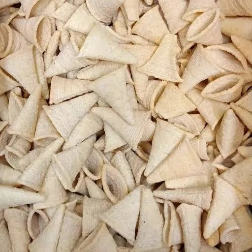

# مقاله‌های اولیه قهقهه

وضعیت هر سه مقاله: پیش‌نویس برای بررسی مالک سایت. هیچ‌کدام از این متن‌ها در وردپرس منتشر نشده‌اند.

## آشنایی با شکل‌های مختلف اسنک

**خلاصه:** نگاهی به شکل و ظاهر اسنک‌ها؛ از مدل‌های قلمی تا مثلثی.

**تصویر شاخص:** assets/snack-sticks-closeup.jpg

ظاهر اسنک‌ها همیشه یکسان نیست. در تصاویر این مطلب، نمونه‌های قلمی و مثلثی دیده می‌شود؛ شکل‌هایی که هرکدام جلوه متفاوتی به ظرف پذیرایی می‌دهند. برای انتخاب محصول، کنار عکس به نام و مشخصات درج‌شده روی بسته‌بندی هم توجه کنید.

### مدل‌های قلمی و مثلثی چه ظاهری دارند؟

نمونه قلمی این مطلب کشیده است و روی سطح آن شیارهای طولی دیده می‌شود. نمونه‌های مثلثی، فرم کوتاه‌تر و پهن‌تری دارند و بعضی از آن‌ها به شکل مخروط توخالی هستند. این تفاوت‌ها هنگام چیدن اسنک در ظرف، به‌خوبی به چشم می‌آیند.

### از روی ظاهر، درباره طعم نتیجه نگیریم

شکل، اندازه یا رنگ یک اسنک، به‌تنهایی طعم و ترکیبات آن را مشخص نمی‌کند. همچنین از روی یک عکس نمی‌توان درباره روش تولید یا مشخصات غذایی محصول نتیجه قطعی گرفت. برای این اطلاعات، برچسب بسته‌بندی و توضیحات همان محصول را بخوانید.

### برای انتخاب دقیق‌تر، بسته‌بندی را ببینید

اگر میان چند مدل مردد هستید، نام محصول، طعم و اندازه بسته را کنار هم یادداشت کنید. هنگام پرسیدن سؤال از فروشنده نیز نام دقیق محصول یا تصویر بسته‌بندی را همراه پیام خود بفرستید تا مشخص شود درباره کدام مدل صحبت می‌کنید.

در بخش محصولات قهقهه می‌توانید نام و تصاویر بسته‌بندی محصولات را ببینید. پیش از انتخاب نهایی، اطلاعات مدل موردنظر را بررسی کنید و پرسش‌های باقی‌مانده را با ذکر همان نام مطرح کنید.

## ایده‌هایی برای سرو اسنک

**خلاصه:** چند ایده ساده برای چیدن اسنک در یک پذیرایی جمع‌وجور.

**تصویر شاخص:** assets/snack-serving-board.jpg

برای چیدن اسنک در یک دورهمی، لازم نیست سراغ ظرف‌های زیاد یا تزئینات پیچیده بروید. یک ظرف ساده، مقدار متناسبی اسنک و چند انتخاب کوچک در چیدمان می‌تواند میز پذیرایی را مرتب‌تر کند. تصویر این مطلب هم یک ایده برای استفاده از تخته پذیرایی و ظرف‌های جداگانه سس است.

### سس‌ها را جدا بگذارید

اگر اسنک را همراه سس سرو می‌کنید، سس‌های مورد علاقه را در ظرف‌های کوچک کنار آن قرار دهید. به این ترتیب، هر نفر می‌تواند مقدار دلخواهش را انتخاب کند و همه اسنک‌ها از ابتدا به یک سس آغشته نمی‌شوند. برای ظرف‌های سس نیز قاشق جدا در نظر بگیرید.

### با مقدار کم شروع کنید

به‌جای بازکردن همه بسته‌ها، ابتدا مقداری متناسب با جمع در ظرف بریزید و در صورت نیاز آن را دوباره پر کنید. بسته‌های اضافه را طبق شرایط نگهداری درج‌شده روی بسته‌بندی نگه دارید. این کار به مرتب‌ماندن میز و مدیریت مقدار پذیرایی کمک می‌کند.

### چیدمان را ساده نگه دارید

برای اسنک‌هایی با شکل‌های متفاوت، می‌توانید از دو ظرف کوچک استفاده کنید یا آن‌ها را در بخش‌های جداگانه یک ظرف بزرگ بچینید. لازم نیست ظرف را تا لبه پر کنید؛ کمی فضای خالی، برداشتن اسنک را آسان‌تر می‌کند و ظاهر چیدمان را منظم نگه می‌دارد.

### نام طعم‌ها را مشخص کنید

اگر چند طعم مختلف سرو می‌کنید، نام هر طعم را از روی بسته بخوانید و کنار ظرف مربوط بنویسید. به‌خصوص زمانی که ظاهر اسنک‌ها شبیه هم است، این برچسب ساده به مهمان‌ها کمک می‌کند انتخابشان را راحت‌تر انجام دهند.

## راهنمای درخواست خرید عمده

**خلاصه:** اطلاعاتی که پیش از ثبت درخواست خرید عمده آماده می‌کنید.

**تصویر شاخص:** assets/cone-snacks-closeup.jpg

برای استعلام خرید عمده، یک درخواست روشن کمک می‌کند محصول موردنظر و جزئیات سفارش از ابتدا مشخص باشد. پیش از ارسال درخواست، نام محصول، مقدار تقریبی و مقصد را آماده کنید. اگر درباره بخشی از سفارش هنوز تصمیم نگرفته‌اید، همان پرسش را به‌صورت مشخص در توضیحات بنویسید.

### محصول و طعم را دقیق مشخص کنید

نام محصول و طعم را از روی بسته‌بندی یا صفحه همان محصول یادداشت کنید. اگر چند مدل می‌خواهید، برای هرکدام یک ردیف جدا در فهرست خود داشته باشید. فرستادن عکس بسته‌بندی نیز می‌تواند به شناسایی مدل کمک کند؛ عکس نزدیک خود اسنک، به‌تنهایی همیشه برای تشخیص محصول کافی نیست.

### مقدار و مقصد را بنویسید

مقدار موردنظر را همراه واحد آن، مانند تعداد بسته یا کارتن، مشخص کنید. تعداد بسته در هر کارتن را فرض نکنید و آن را هنگام استعلام بپرسید. شهر مقصد و زمان موردنظر برای دریافت را هم بنویسید تا جزئیات درخواست روشن باشد.

### این اطلاعات را همراه درخواست بفرستید

- نام شما و نام فروشگاه یا مجموعه، در صورت وجود
- نام دقیق محصولات و طعم‌های موردنظر
- مقدار تقریبی با واحد مشخص
- شهر مقصد و راه ارتباطی برای پاسخ به درخواست

### شرایط را پیش از نهایی‌کردن بررسی کنید

قیمت، موجودی، حداقل مقدار سفارش، شرایط پرداخت و شیوه ارسال را برای درخواست خود استعلام کنید. این موارد در این مطلب تعیین نشده‌اند. ثبت فرم خرید عمده، ارسال درخواست بررسی است؛ نهایی‌شدن سفارش به توافق درباره جزئیات آن نیاز دارد.
